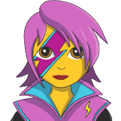

<p align="center">
  <a href="https://www.gatsbyjs.org">
    
  </a>
  <a href="https://tailwindcss.com">
    
  </a>
  <a href="https://emotion.sh">
    
  </a>
</p>
<h1 align="center">
  Appainter Home Page
</h1>

## 💄 App URL

To be published at [appainter.net](https://www.appainter.net)

## 🚀 Quick start

1.  **Start development**

    ```shell
    gatsby develop
    ```

2.  **Open the source code and start editing!**

    Site runs development server at `http://localhost:8000`!


## ✨ Features?

- **Tailwind CSS**: The full power of Tailwind is at your fingertips. Style your components using [twin.macro](https://github.com/ben-rogerson/twin.macro) to add Tailwind classes to your project.
  
- **Emotion**: Best-in-class CSS-in-JS support with [Emotion](https://emotion.sh). Write your own custom styled components with Emotion or use `twin.macro` inside your styled components to add Tailwind CSS classes alongside your styling.
  
- **PostCSS**: Use the flexibility of [PostCSS](https://postcss.org/) to extend Tailwind's CSS or write your own CSS. [Postcss-Preset-Env](https://preset-env.cssdb.org/) is enabled out-of-the box.

## 📦 Example components

### Standalone Tailwind Classes

```js
import tw from "twin.macro"
import React from "react"

const Heading = tw.h1`
  text-2xl text-gray-500 uppercase
`
```

### Styled Components with Emotion

```js
import tw, { styled } from "twin.macro"
import React from "react"

const Container = styled.div`
    ${tw`bg-gray-100 w-full`}
    background-image: url(${background});
    padding: 15px;
`
```

### Combined Standalone + Styled Components

```js
import tw, { styled } from "twin.macro"
import React from "react"

const Container = styled.div`
    ${tw`bg-gray-100 w-full`}
    background-image: url(${background});
    padding: 15px;
`

const Heading = tw.h1`
  text-2xl text-gray-500 uppercase
`
```

### CSS Prop to inline Tailwind Classes

```js
import tw, { css } from "twin.macro"
import React from "react"

export default () => (
  <div
    css={css`
      ${tw`flex items-center justify-between px-4 py-3`}
    `}
  >
    <h1>Hello, world!</h1>
    <h2>I'm a flex item too!</h2>
  </div>
)
```

## 💫 Deploy

[](https://app.netlify.com/start/deploy?repository=https://github.com/thaismr/Appainter-Gatsby-Home)

## 📚 Learn More

- [Gatsby Documentation](https://www.gatsbyjs.com/docs/) - learn about Gatsby's features and API.
  